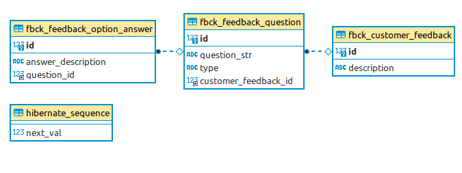

# Prueba Técnica - Proceso RobinFood (Backend Developer)
### Realizado por Oswaldo Gonzalez 
https://www.linkedin.com/in/oagonzalezp

## Prueba técnica

Utilizando el framework de spring boot (java) se debe realizar una API Rest que cumpla con los siguientes requerimientos.

Un restaurante requiere un sistema que permita listar una encuesta a sus clientes para recibir el feedback de sus servicios; la encuesta tiene debe de tener un listado de preguntas de tipo abiertas y selección múltiple con sus respectivas respuestas.

Criterios de aceptación
- Se debe exponer un servicio que permita listar una encuesta con sus respectivas preguntas.
- Se debe exponer un servicio que permita registrar la encuesta.
- Implementar test unitarios.
- Las encuesta puede tener una o varias preguntas de tipo abierta o selección múltiple.
- (No implementar ningún tipo de seguridad)

## Implementación

#### Herramientas utilizadas <br>

- IntelliJ 2021.1.3
- JDK 11
- Git
- MySQL 5 o superior
- Maven 6.9.3 
- Linux mint

#### Se creó un API para la creación de encuestas <br>
`POST /v0/feedback` <br>
<br>**REQUEST**<br>
```json  
{
  "description": "Nueva encuesta",
  "questions" : [{
    "questionStr": "¿Cual es la calidad de nuestro servicio?",
    "type": "MULTIPLE",
    "answers": [{
      "answerDescription" : "Alta"
    },{
      "answerDescription" : "Muy Alta"
    }]
  }]
}
```
<br>**RESPONSE**<br>
```json  
{
  "code": 1,
  "data": 9
}
```

#### Se creó un API para listar las encuestas registradas <br>
`GET /v0/feedback` <br>
<br>**REQUEST**<br>
**--**
<br>**RESPONSE**<br>
```json  
{
  "code": 1,
  "data": [
    {
      "description": "Nueva encuesta",
      "questions": [
        {
          "questionStr": "¿Cual es la calidad de nuestro servicio?",
          "type": "MULTIPLE",
          "answers": [
            {
              "answerDescription": "Alta"
            },
            {
              "answerDescription": "Muy Alta"
            }
          ]
        }
      ],
      "id": 1
    },
    {
      "description": "Nueva encuesta",
      "questions": [
        {
          "questionStr": "¿Cual es tu deporte favorito?",
          "type": "MULTIPLE",
          "answers": [
            {
              "answerDescription": "Futbol"
            },
            {
              "answerDescription": "Baseball"
            }
          ]
        }
      ],
      "id": 5
    },
    {
      "description": "Nueva encuesta 3",
      "questions": [
        {
          "questionStr": "¿Cual es el nombre de tu primer colegio?",
          "type": "OPEN",
          "answers": []
        },
        {
          "questionStr": "¿Cual es tu serie favorita?",
          "type": "MULTIPLE",
          "answers": [
            {
              "answerDescription": "Friends"
            },
            {
              "answerDescription": "Game of Thrones"
            }
          ]
        }
      ],
      "id": 9
    }
  ]
}
```

#### Modelo relational <br>



#### Archivo httpd <br>

[feedback.http](request/feedback.http)


#### Postman Collection <br>

[https://www.getpostman.com/collections/3225a861c35f28bc78ad](https://www.getpostman.com/collections/3225a861c35f28bc78ad)

