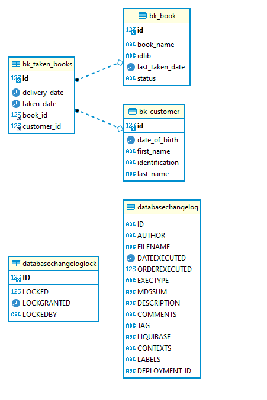

# Prueba Técnica - Proceso Serfinanza (Backend Developer)
### Realizado por Oswaldo Gonzalez 
https://www.linkedin.com/in/oagonzalezp

## Prueba técnica

Leer el requerimiento a continuación y estimar el tiempo en horas suministrado para FrontEnd y
BackEnd. Para esto, puede ayudarse creando una lista de tareas, ejecutar la prueba y al finalizar
registrar el tiempo total consumido (Consolidar el detalle de la estimación, tareas y tiempo real
ejecutado. ...

## Implementación

#### Herramientas utilizadas  

- IntelliJ 2021.1.3
- JDK 11
- Git
- MySQL 5 o superior
- Maven 6.9.3 
- Linux mint

#### Modelo relational  

#### Archivo httpd  

[backend.http](backend/backend.http)

#### Ejecucion  
#### Backend
- Crear la base de datos con el siguiente comando
    `CREATE DATABASE serfinanza-book;`
- Cambiar las credenciales de Mysql en el archivo [application-local.properties](backend/src/main/resources/application-local.properties)  
- Ejecutar el modulo backend con los siguientes comando

  `cd backend`  
  `mvn spring-boot:run`
- La dependencia de liquibase ejecutará automaticamente los scripts de inicio

#### Frontend
- Ejecutar el modulo frontend con los siguientes comando

  `cd frontend`  
  `mvn jetty:run -DskipTests`

